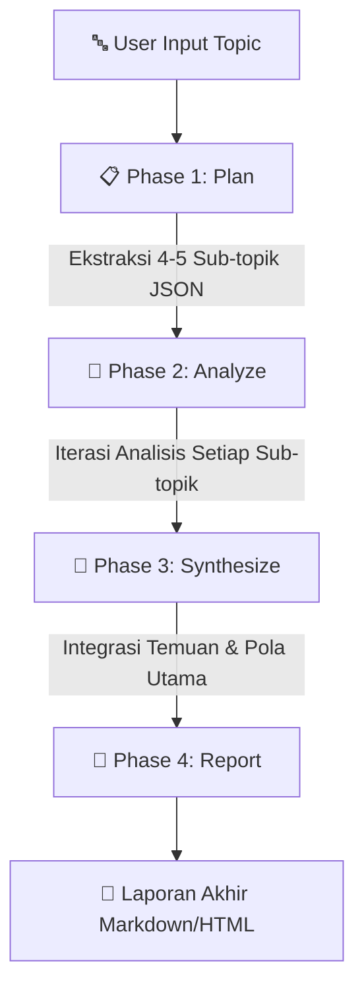

<div align="center">

# 🔬 ResearchMind — Agentic AI Research Assistant

<p align="center">
  <strong>Agen Riset Otonom Berbasis Multi-Phase LLM Orkesasi</strong>
</p>

[](https://console.groq.com)
[](https://pages.github.com)
[](LICENSE)

<br/>

[Live Demo](#-panduan-deployment-github-pages) • [Fitur Utama](#-fitur-utama) • [Arsitektur Agen](#-arsitektur-agen-4-tahap) • [Cara Install](#-panduan-instalasi--penggunaan-lokal)

</div>

---

## 📌 Ikhtisar Proyek

**ResearchMind** adalah aplikasi web otonom berarsitektur **Agentic AI** yang dirancang untuk melakukan riset komprehensif secara otomatis berdasarkan satu topik input pengguna. 

Dibangun dengan arsitektur **Clean JavaScript (ES Modules)** dan antarmuka bertema **Warm Orange / Clean Light Mode** yang profesional, agen ini memecah masalah kompleks menjadi beberapa sub-tugas yang dijalankan secara hirarkis menggunakan **Groq Llama 3.3 70B Versatile**.

---

## ✨ Fitur Utama

- 🧠 **4-Phase Autonomous Pipeline**: Mengelola proses dari perencanaan (*Plan*), analisis (*Analyze*), sintesis (*Synthesize*), hingga penyusunan laporan (*Report*).
- ⚡ **Super Fast Inference (Groq Engine)**: Menggunakan model `llama-3.3-70b-versatile` via Groq Cloud REST API dengan performa kecepatan tinggi.
- 🎨 **UI/UX Profesional (Anti-AI Generic Chatbot)**: Desain kartu modern dengan palet warna krem-oranye lembut, mikro-animasi, indikator langkah interaktif, dan panel log real-time.
- ⚙️ **Pengaturan Kedalaman Riset**: Pilihan mode *Singkat* (2-3 paragraf), *Standar* (4-5 paragraf), dan *Mendalam* (6-8 paragraf + data komprehensif).
- 🔒 **Sistem API Key Aman & Terisolasi**: Support injection API Key secara lokal via `config.js` (`.gitignore`) maupun CI/CD via **GitHub Actions Secrets**.
- 📑 **Export Laporan**: Laporan akhir tersusun rapi dengan Markdown renderer internal dan fitur cetak/simpan PDF interaktif.

---

## 🧬 Arsitektur Agen (4 Tahap)

Agen bekerja secara otonom melalui alur kerja berurutan sebagai berikut:



### Penjelasan Detail 4 Tahap:

1. **Phase 1 — Perencanaan (Plan)**: Agen menganalisis topik riset utama dan memecahnya secara cerdas menjadi 4–5 sub-topik terstruktur dalam format JSON.
2. **Phase 2 — Analisis Sub-Topik (Analyze)**: Agen mengiterasi setiap sub-topik dan melakukan analisis mendalam sesuai tingkat kedalaman yang dipilih pengguna.
3. **Phase 3 — Sintesis Temuan (Synthesize)**: Agen menggabungkan seluruh temuan sub-topik, mengidentifikasi keterkaitan antar variabel, serta menemukan kesimpulan inti.
4. **Phase 4 — Penyusunan Laporan (Report)**: Agen menyusun laporan akademis lengkap yang terdiri dari *Pendahuluan*, *Pembahasan Sub-topik*, *Sintesis*, serta *Kesimpulan & Rekomendasi*.

---

## 📂 Struktur Direktori Proyek

```text
Agentic-AI/
├── .github/
│   └── workflows/
│       └── deploy.yml          # GitHub Actions workflow untuk auto-deploy ke Pages
├── assets/
│   ├── css/
│   │   └── style.css           # Vanilla CSS Design System & Utility classes
│   └── js/
│       ├── agent.js            # Business Logic: GroqClient & ResearchAgent Engine
│       ├── ui.js               # UI Renderer, DOM updates, Toast & Markdown Parser
│       └── main.js             # Application Orchestrator & Event Handlers
├── config.example.js           # Template konfigurasi API Key lokal
├── .gitignore                  # Menjaga file sensitif (config.js) tidak ter-commit
├── index.html                  # HTML Semantic Entry Point
├── LICENSE                     # MIT License
└── README.md                   # Dokumentasi proyek
```

---

## 🚀 Panduan Instalasi & Penggunaan Lokal

### Prasyarat
- Browser modern (Chrome, Firefox, Edge, atau Safari) dengan dukungan ES Modules.
- Groq API Key gratis dari [console.groq.com](https://console.groq.com).

### Langkah Jalankan di Lokal:

1. **Clone repository**:
   ```bash
   git clone https://github.com/Sam9100/Agentic-AI.git
   cd Agentic-AI
   ```

2. **Buat file Konfigurasi `config.js`**:
   Salin `config.example.js` menjadi `config.js`:
   ```bash
   copy config.example.js config.js
   ```

3. **Isi API Key di `config.js`**:
   Buka `config.js` dan ganti `'YOUR_GROQ_API_KEY_HERE'` dengan API Key Groq kamu:
   ```javascript
   window.GROQ_API_KEY = 'gsk_xxxxxxxxxxxxxxxxxxxxxxxx';
   ```

4. **Buka Aplikasi**:
   Cukup klik ganda / buka file `index.html` langsung di browser kamu! Form API key di web akan **otomatis tersembunyi** karena key sudah terbaca dari `config.js`.

---

## 🌐 Panduan Deployment GitHub Pages

Proyek ini telah dilengkapi **CI/CD Workflow** bawaan via GitHub Actions yang akan secara otomatis menyuntikkan API Key dari **GitHub Secrets** tanpa pernah mengeksposnya ke dalam kode publik.

### Langkah-langkah Deploy:

1. Push seluruh kode kamu ke branch `main` GitHub Repository.
2. Buka Repository di GitHub → **Settings** → **Secrets and variables** → **Actions**.
3. Klik **New repository secret**:
   - **Name**: `GROQ_API_KEY`
   - **Secret**: *(Paste API Key Groq kamu)*
4. Masuk ke **Settings** → **Pages**:
   - Pada bagian **Build and deployment > Source**, pilih **GitHub Actions**.
5. Setiap kali kamu push ke `main`, GitHub Actions akan otomatis membagun `config.js` dan men-deploy web kamu ke GitHub Pages secara gratis!

---

## 🛠️ Teknologi yang Digunakan

- **Frontend**: HTML5, Vanilla CSS3 (Custom Properties & Flex/Grid Layout), Vanilla JS (ES6+ ES Modules)
- **AI Core**: Groq REST API (`llama-3.3-70b-versatile`)
- **Typography**: Plus Jakarta Sans & Lora (Google Fonts)
- **CI/CD**: GitHub Actions & GitHub Pages

---

## 📄 Lisensi

Proyek ini dilindungi di bawah lisensi [MIT License](LICENSE). Bebas digunakan dan dikembangkan kembali untuk keperluan akademik maupun personal.

---

<div align="center">
  <sub>Dibuat dengan ❤️ untuk Tugas Besar Kecerdasan Buatan (Agentic AI)</sub>
</div>
